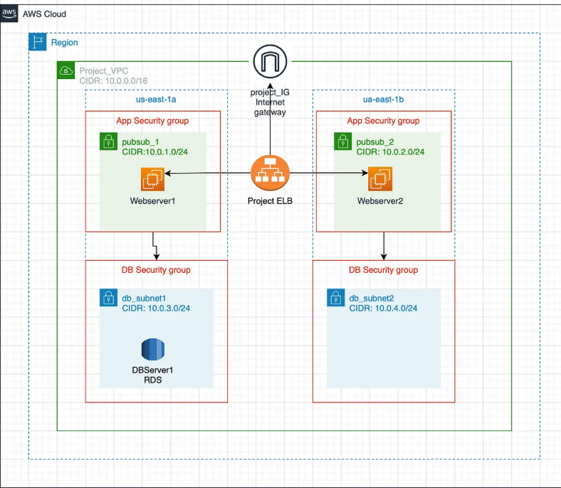

# AWS-2-Tier-Application-with-Terraform

This project provisions a modular, production-style 2-tier architecture on AWS using Terraform. It includes:

- ✅ VPC with public/private subnets across 2 AZs
- 🌐 Internet Gateway + NAT Gateway
- 🖥️ EC2 instances running httpd webserver
- ⚖️ Application Load Balancer (ALB)
- 🗄️ RDS (MySQL) with secure connectivity
- 🔐 Security groups and route tables
- 📦 Modular Terraform structure

## 📊 Architecture Diagram

## 🚀 Deployment Instructions

### 1. Clone the Repository

git clone https://github.com/your-username/terraform-aws-2tier-app.git

cd terraform-aws-2tier-app

### 2. Initialize Terraform

terraform init

### 3. Review the Plan

terraform plan

### 4. Apply the Infrastructure

terraform apply

## 🌐 Application Behavior
- EC2 instances run a simple web app via Apache (httpd)
- App connects to RDS using environment variables injected via user_data
- On visiting the ALB DNS, you’ll see a hostname of the server to which it is connected to and also the link to test the connectivity to the RDS database

## 🔐 Security Design
- ALB allows inbound HTTP traffic from the internet
- EC2 allows traffic only from ALB
- RDS allows traffic only from EC2
- Private subnets route outbound traffic via NAT Gatewa

## 📤 Outputs
After deployment, Terraform will display:
- ✅ ALB DNS name (access your app here)
- ✅ EC2 public IPs (for SSH/debugging)
- ✅ RDS endpoint (used by the app)

## 🧹 Cleanup
To destroy all resources:
terraform destroy

## 🧠 Lessons Learned
- Importance of subnet placement and AZ coverage for RDS
- Using templatefile() to inject dynamic values into EC2 user_data
- Modular design improves reusability and clarity
- Security group chaining for tiered access control
